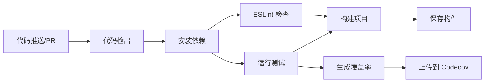

# CI/CD 配置文档

本项目使用 GitHub Actions 实现持续集成和持续部署。

## 📋 工作流概览

### 1. CI Pipeline (`.github/workflows/ci.yml`)

**触发条件**：
- 推送到 `main` 或 `develop` 分支
- 创建针对 `main` 或 `develop` 的 Pull Request

**执行流程**：



**测试矩阵**：
- Node.js 18.x
- Node.js 20.x

**输出产物**：
- 测试覆盖率报告
- 构建产物 (dist/)
- PR 自动评论

---

### 2. Deploy Pipeline (`.github/workflows/deploy.yml`)

**触发条件**：
- 推送到 `main` 分支
- 手动触发 (workflow_dispatch)

**执行流程**：


---

## 🚀 快速开始

### 首次设置

1. **启用 GitHub Pages**
   ```bash
   # 在仓库设置中：
   # Settings -> Pages -> Source
   # 选择 "GitHub Actions"
   ```

2. **配置 Codecov（可选）**
   ```bash
   # 访问 https://codecov.io
   # 使用 GitHub 登录
   # 添加仓库并获取 token
   # 在仓库 Settings -> Secrets and variables -> Actions 中添加：
   # CODECOV_TOKEN = <your-token>
   ```

3. **推送代码触发 CI**
   ```bash
   git add .
   git commit -m "feat: 添加 CI/CD 配置"
   git push origin main
   ```

---

## 📊 测试覆盖率

### 本地查看

```bash
# 生成覆盖率报告
npm run test:coverage

# 在浏览器中查看
open coverage/index.html
```

### CI 中查看

1. 访问仓库的 Actions 标签
2. 选择最新的工作流运行
3. 下载 `test-results-*` 构件
4. 解压查看 `coverage/index.html`

### Codecov 集成

覆盖率会自动上传到 Codecov（如果配置了 token）。

在 README 中添加徽章：
```markdown
[](https://codecov.io/gh/YOUR_USERNAME/NewsSystemPro)
```

---

## 🔧 工作流详解

### CI Pipeline 任务

#### 1. **Test & Lint Job**

```yaml
- ESLint 代码检查
- Vitest 单元测试
- 覆盖率报告生成
- 多 Node.js 版本矩阵测试
```

**失败处理**：
- ESLint 失败不会阻止 CI (continue-on-error)
- 测试失败会阻止合并

#### 2. **Build Check Job**

```yaml
- 依赖于 Test Job
- 验证生产构建
- 检查构建产物大小
- 保存构建结果
```

#### 3. **Comment PR Job**

```yaml
- 仅在 PR 时触发
- 自动评论测试结果
- 提供覆盖率摘要
- 链接到详细报告
```

---

### Deploy Pipeline 任务

#### 1. **Build Job**

```yaml
- 安装依赖
- 运行测试（确保质量）
- 生成生产构建
- 准备部署构件
```

#### 2. **Deploy Job**

```yaml
- 部署到 GitHub Pages
- 输出部署 URL
- 记录部署日志
```

---

## 🎯 最佳实践

### 分支策略

```
main (受保护)
  ├── develop (开发分支)
  └── feature/* (功能分支)
```

### 保护规则建议

在 `Settings -> Branches -> Branch protection rules` 中配置 `main` 分支：

- ✅ Require a pull request before merging
- ✅ Require status checks to pass before merging
  - ✅ Test & Lint (ubuntu-latest, 20.x)
  - ✅ Build Check
- ✅ Require branches to be up to date before merging
- ✅ Require conversation resolution before merging

---

## 📈 性能优化

### 缓存策略

```yaml
# 使用 npm cache 加速安装
- uses: actions/setup-node@v4
  with:
    cache: 'npm'
```

### 并发控制

```yaml
# 避免重复构建
concurrency:
  group: ${{ github.workflow }}-${{ github.ref }}
  cancel-in-progress: true
```

---

## 🐛 故障排查

### 常见问题

#### 1. 测试失败

```bash
# 本地运行测试
npm run test:run

# 查看详细日志
npm run test -- --reporter=verbose
```

#### 2. 构建失败

```bash
# 检查构建
npm run build

# 清除缓存重试
rm -rf node_modules dist
npm install
npm run build
```

#### 3. 部署失败

- 检查 GitHub Pages 是否启用
- 确认 Pages 设置为 "GitHub Actions"
- 检查仓库权限设置

---

## 🔒 安全性

### Secrets 管理

在 `Settings -> Secrets and variables -> Actions` 中添加：

| Secret | 用途 | 必需 |
|--------|------|------|
| `CODECOV_TOKEN` | 上传覆盖率报告 | 可选 |
| `DEPLOY_TOKEN` | 自定义部署 | 可选 |

### 权限最小化

```yaml
permissions:
  contents: read      # 读取代码
  pages: write        # 写入 Pages（仅部署）
  pull-requests: write # 评论 PR（仅 CI）
```

---

## 📚 扩展阅读

- [GitHub Actions 文档](https://docs.github.com/en/actions)
- [Vitest 配置](https://vitest.dev/config/)
- [Codecov 集成](https://docs.codecov.com/docs)
- [GitHub Pages 部署](https://docs.github.com/en/pages)

---

## 🆘 获取帮助

遇到问题？
1. 查看 [Actions 日志](../../actions)
2. 阅读 [TESTING_GUIDE.md](../TESTING_GUIDE.md)
3. 提交 [Issue](../../issues/new)
